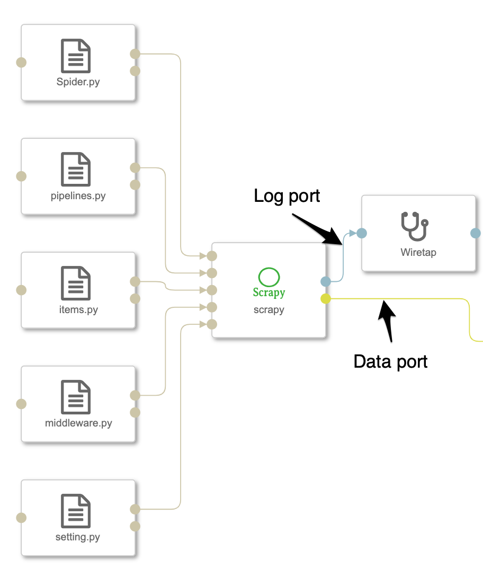
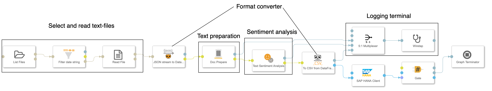
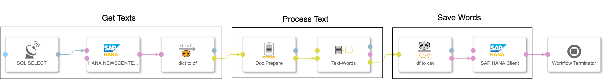
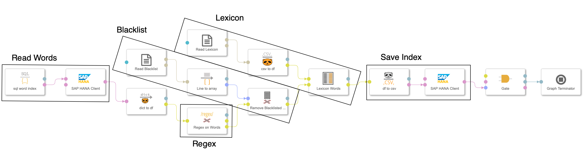

### Attention
Due to unnoticed sync fight between Microsoft OneDrive and Github Desktop some code was scrambled. I tried to clean up the mess but there might still be some remnants left. 

# Text Analysis Framework deployed on SAP Data Intelligence

## Description
### Introduction

There are basically 2 approaches for doing a text analysis: 

1. Brute force blackbox single step approach or 
2. Step-by-step

The brute force approach is using a text as a whole and classifies the text by using 'Deep Learning' techniques. The most familiar classifications are the **sentiment** and **subjectivity** polarity. Based on the type of the corpus the result could be quite good even for short texts like in twitter or movie and product reviews. But due to the very nature of language of being able to convey all kinds of information in numerous ways and because you need mostly an extensive amount of trained data this approach is of limited practicality.

The second step-by-step approach could also use models trained by *deep learning* techniques but in a more controlled way and combined with other techniques in a kind of process pipeline. For example for the grammatical analysis a deep learning trained model could be of great use to create word bags that can subsequently been evaluated to find similar topics in texts by applying cluster algorithms. 

For a proof-of-concept we have done both ways. A simple sentiment scoring of the texts and a word indexing pipeline. The word index can then be used for 
further researches like the 

1. trend of positively annotated brands in news or forums or
2. word groups with a high correlation probability

As a text corpus we are using online media articles that we scrape on a daily basis. For a start we selected 2 French (Le Figaro, Le Monde), 2 Spanish (El Mundo, El Pais) and 3 German newspaper (Der Spiegel, FAZ, Süddeutsche).
 

### Website Scraping with *Scrapy*

For the website scraping we used the open source tool framework [scrapy](http://scrapy.org). With limited effort we could create so-called spiders for each website that extracts the information we sought after. For automating this article retrieval process we

1. created a docker container with installed scrapy and the folder structure needed and
2. developed an configurable operator that receives the specific scrapy configuration files (setting.py, pipelines.py, items.py, middleware.py and spider.py) 

There are numerous online tutorials for scrapy but as a start you can go for the official [scrapy tutorial](https://docs.scrapy.org/en/latest/intro/tutorial.html).

The output of the operator are a *log-port* and a *data-port* sending the scraped data of each spider as a DataFrame. 



For our project we store the online articles using the *JSON*-format to an object store and additionally the metadata ('text_id', 'date', 'media', 'url', 'title', 'num_characters', 'rubric') in a HANA database. 


### Sentiment Analysis 
As a first step we used the sentiment algorithm of the NLP package [textblob](https://textblob.readthedocs.io/en/dev/index.html) for a quick win. Without further text cleansing we used the textblob algorithms for French, German and English to get the polarity (-1-negative to 1-positve) and the subjectivity (0-neutral to 1-subjective). The underlying algorithm is a model trained on movie reviews. If you take the results cum grano salis we learnt that the results are at least a good indicator.

Nonetheless I wanted to compare this with another, lexicographical technique summarizing words according to their annotated sentiment. Therefore I used a sentiment dictionary found in a publication of Peter Sheridan Dodds et. al. at [PNAS.org](https://www.pnas.org/content/112/8/2389) and calculated the average of the sentiments of the annotated words found in the articles. 



### Word Analysis
During the project we learnt that it makes sense to split the task into a 2-staged process: 

1. Get **words** from text
2. Index **words** by selecting types, cleansing from blurring words and adding mappings to semantically similar words.

This 2-staged approach is reflected by 2 pipelines. 

#### Tokenizing the Text
For splitting the text into grammatical entities the open source framework [spaCy](https://spacy.io) is been used. In addition also the entity detection (person, organization, location) can be applied although only persons delivered results of a satifying level. It is the more time consuming process step and there should not be to much pre-selection added that later would be sorefully regretted. There are basically 2 operators supporting this stage: 

1. **Pre-processing** (operator: Doc Prepare)  - formating the text, removing tags and common typos and converting it into our 'standard' format: 'text_id', 'language' and 'text' with data type DataFrame
2. **Words-Text** (operator: Words from Text) - Tokenizing the text and creating word bags of different types

All operators are "Custom Python"-operators that can easily be edited. Although the **pre-processing** operator has been designed as generally usable as possible, it is prone for adjustments. Currently 2 kinds of documents has been used as a starter for the design: News articles in a HANA-database having still HTML-tags included and plain text of onlinemedia provided by JSON-documents. 

The output of the pipeline is stored to the database tabel 'word_text' with the following structure: 

* 'text_id' - reference to text, 
* 'language', 
* 'type' - type of word (proper noun, noun, verb, location, person, ...),
* 'word', 
* 'count' - number of words in text




#### Indexing Text
The second one could be either done with sql-statements or for more elaborate processes using python scripts. This provides the flexibility to adjust the text analysis to the desired outcome. There are 4 operators supporting this step: 

1. **sql_word_index** - Selecting words from the base word table that has been created in the previous stage. Limits can be passed for each word type to only select words that appears more frequently than the given limit. This constraint eleminates a lot of words, that have passed the pre-selection although containing numbers or special characters. 
2. **word_regex** - Removing words with certain patterns or replacing patterns. For both configuration parameters "removing" and "replacing" a list of regular expressions can be passed. There is an outport 'removed' that exports the changes of the regular expressions in order to verify that it works like intended. 
3. **word_blacklist** - Removing words that are on a 'blacklist' because they are very common and contorts the outcome, e.g. the 'country', 'publishing location', 'media'. 
4. **word_lexicon** - Map words according to the lexicon file to predefined keywords, synonyms, etc. Examples: 'corona', 'corona-virus', 'corona-pandemic' can all be mapped to 'corona'.





### Docker Image
Fortunately there is no other installation needed as the package installations with **pip** and therefore the python base image provided by SAP can be used:

 */com.sap.datahub.linuxx86_64/sles:15.0-sap-007* 
 
 The minimum required  docker file would then be look like: 
 
```
FROM §/com.sap.datahub.linuxx86_64/sles:15.0-sap-007

# basic setup with additional user
RUN groupadd -g 1972 textanalysis && useradd -g 1972 -u 1972 -m textanalysis
USER 1972:1972
WORKDIR "/home/textanalysis"
ENV HOME=/home/textanalysis
ENV PATH="${PATH}:${HOME}/.local/bin"

# Main packages for text analysis
# scrapy, pandas, spacy, nltk and requests (optional)
RUN python3 -m pip install scrapy --user
RUN python3 -m pip --no-cache-dir install pandas --user
RUN python3 -m pip --no-cache-dir install nltk --user
RUN python3 -m pip --no-cache-dir install spacy --user
RUN python3 -m pip --no-cache-dir install requests --user 

# utilies for operator development provided by thorsten hapke
RUN python3 -m pip --no-cache-dir install sdi_utils >=0.0.77 --user

# pre installation of languages
RUN python3 -m spacy download de_core_news_sm --user
RUN python3 -m spacy download fr_core_news_sm --user
RUN python3 -m spacy download es_core_news_sm --user
RUN python3 -m spacy download en_core_web_sm --user
RUN python3 -m pip --no-cache-dir install textblob --user
RUN python3 -m pip --no-cache-dir install textblob-de --user
RUN python3 -m pip --no-cache-dir install textblob-fr --user

# create the scrapy environment
RUN scrapy startproject onlinemedia
```

If you read the log-file created by scrapy you might see a warning: 

```
WARNING: /home/textanalysis/.local/lib/python3.6/site-packages/pandas/compat/__init__.py:117: UserWarning: Could not import the lzma module. Your installed Python is incomplete. Attempting to use lzma compression will result in a RuntimeError.
```
So far I have not seen any impact. Of course you can install the lzma package with zypper but then you have to change the base image to : opensuse/leap:15.0.


## Github Structure

This repository has the following structure: 

* **/src** - contains the code of all di_textanalyis operators that can be modified and tested locally and uploaded using the *gensolution-package* ([on github](https://github.com/thhapke/sdi_utils)) or [pypi.org](https://pypi.org/project/sdi-utils/). Each src-file contains also code that produces a ready-to-upload solution package stored to the solution directory
* **/solution** - containing the solution packages for the dockerfile, pipelines and operators. Each operator has a rudimentary documentation yet generated from the operator-code
* **/data_repository** - example data to test the operators and run the solution like blacklist.txt, lexicon.csv, sentiments_DE.csv
* **/images** - with screenshots and icons
* **/jnb** - Jupyter Notebooks for analysing the result
* **/utils** - Code that helped for the project but not belong to the core
* **/word-in-progress** - Code the could become part of the 'core' but are still in development, e.g.  here you find code to detect topics in texts. 
* **/sql** - sql-statement for creating the target tables in HANA. 

## Requirements
* SAP Data Intelligence Release >3.0 
* Specific python packages (see Dockerfile)
	* [spaCy](https://spacy.io) 
	* [scrapy](http://scrapy.org)
	* [textblob](https://textblob.readthedocs.io/en/dev/index.html)


## Download and Installation
Have a look at the previous section: 'GitHub Structure'

## Known Issues
There are currently no know issues.

## How to obtain support
This is an example code without any commitment for getting support. Nonetheless please contact me (thorsten.hapke@sap.com) if you have any questions or have run into an issue.

## Contributing
This solution crucially depend on **scrapy** and **spacy**.

## To-Do
Any additions will be triggered by specific customer requests. Nonetheless plesae let me know if you have any ideas for enhancements. 

## License
Copyright (c) 2020 SAP SE or an SAP affiliate company. All rights reserved. This file is licensed under the Apache Software License, version 2.0 except as noted otherwise in the [LICENSE](LICENSES/Apache-2.0.txt) file.

 


 